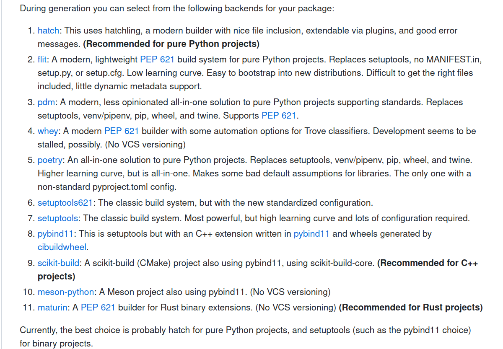
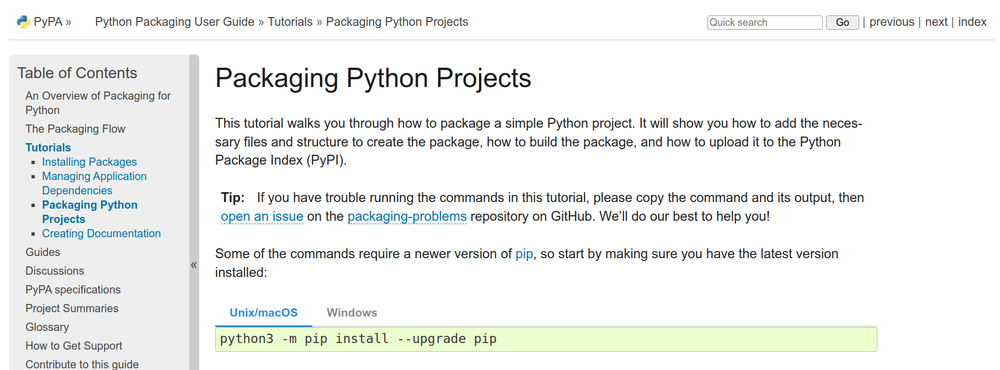
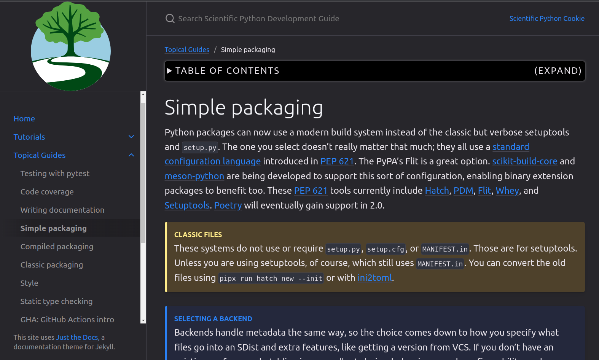

class: middle, center, title-slide
count: false

# Distributing your Science:<br> Turning analyses into scientific tools
.large.blue[Matthew Feickert]<br>
.large[(University of Wisconsin-Madison)]
<br>
[matthew.feickert@cern.ch](mailto:matthew.feickert@cern.ch)
<br>

ORIGINS Data Science Lab Forum

September 8th, 2023

---

# Talk Notes

* .bold[Abstract]: Scientific analysis is driven forward by software, which is often created and developed by the same scientists performing the analysis. As the expected skill set breadth of the modern scientist continues to grow with the rapid progress of computational techniques, the challenge of productionizing scripts and examples into robust and reusable computational tools can be daunting. This seminar will provide best practice resources, motivating examples, and demonstrations for how scientists can transform real world analyses into reusable, publicly distributed scientific tools using modern open source tool chains. The focus will be on the scientific Python ecosystem and build tools, but will include demonstrations of Pythonic bindings to C++ tooling as well as examples from the Julia community.
* .bold[Talk time]: 30 to 45 minutes

---
# My motivations on this topic

.kol-1-2[
.large[
* Postdoc in high energy physics and data science at University of Wisconsin-Madison Data Science Institute
* Analysis Systems area lead for IRIS-HEP
* Lucky to be an ATLAS colleague of the Heinrich group :)
* Care about .bold[reusable] open science
]
]
.kol-1-2[
.center.width-70[[](https://datascience.wisc.edu/institute/)]

.center.width-50[[](https://iris-hep.org/)]

.center.width-60[[](https://zenodo.org/)]
]

---
# Knowledgeable colleagues

<br>

.grid[
.kol-1-2.center[
<!-- https://avatars.githubusercontent.com/u/4616906?v=4 -->
.circle.width-55[]

[Henry Schreiner](http://iscinumpy.dev/)

Princeton University, IRIS-HEP, PyPA, Scikit-Build
]
.kol-1-2.center[
<!-- https://avatars.githubusercontent.com/u/1248413?v=4 -->
.circle.width-50[]

[Angus Hollands](https://github.com/agoose77)

Princeton University, The Executable Books Project
]
]

.center[Most of what we will discuss today has been covered extensively by them]

---
# Hypothetical workflow for the typical scientist

<!-- TODO: Spread this out across multiple slides with images -->

.huge[
1. Work on idea for paper with collaborators
2. Do exploratory analysis in scripts and Jupyter ecosystem
3. As research progresses need to write more complicated functions and workflows
4. Code begins to sprawl across multiple directories
5. Software dependencies begin to become more complicated
6. The code "works on my machine", but what about your collaborators?
]

.center.huge.bold[People heroically press forward, but this is painful, and not reusable]

---
# Reusable science, step by step

.large[
In this first scenario, you will probably see a lot of `sys.path` manipulation and `utils.py`
]

.huge[
```
$ tree examples/edit_sys_path
examples/edit_sys_path
├── code
│   └── utils.py  # helper functions rosen, rosen_der
├── example.py  # want to import rosen, rosen_der
└── jupytext.toml

1 directory, 3 files
```
]

---
# Reusable science, step by step

.large[
In this first scenario, you will probably see a lot of `sys.path` manipulation and `utils.py`
]

.large[
```python
# example.py
import sys
from pathlib import Path

# Make ./code/utils.py visible to sys.path
sys.path.insert(1, str(Path(__file__).parent / "code"))
from utils import rosen, rosen_der

x0 = np.array([1.3, 0.7, 0.8, 1.9, 1.2])
result = minimize(rosen, x0, method="BFGS",
                  jac=rosen_der, options={"disp": True})
optimized_params = result.x
# array([1.00000004, 1.0000001 , 1.00000021, 1.00000044, 1.00000092])
```
]

---
# Reusable science, step by step

.large[
In this first scenario, you will probably see a lot of `sys.path` manipulation and `utils.py`

* This is _already better_ than having everything in a single massive file
* However, now things are tied to this relative path on your computer

```python
# Make ./code/utils.py visible to sys.path
sys.path.insert(1, str(Path(__file__).parent / "code"))
from utils import rosen, rosen_der
```

and are brittle to refactoring and change

* But we can do much better!
]

---
# Next steps: Packaging your code

.huge[
* Real emphasis is just that .bold[your code is now installable]
   - Anywhere your Python virtual environment is active you can use your code

* So following The Zen of Python this should be very straightforward?
]
.large[
```
$ python -c 'import this' | grep obvious
There should be one-- and preferably only one --obvious way to do it.
Although that way may not be obvious at first unless you're Dutch.
```
]

---
# Next steps: Packaging your code

.huge[
Maybe not so much. :(
]

<!-- Centering wasn't working without HTML -->
<p style="text-align:center;">
   <a href="https://github.com/scientific-python/cookie">
      
   </a>
</p>

.center.huge[
You might be asking: Why is there more than one thing?
]

---
# Next steps: Packaging your code

.huge[
The .blue[good news]: Python packaging has improved .bold[dramatically] in the last 5 years
]

* It has never been easier to just point your package manager to some code locally, or on the internet, and get working Python code installed and running on your machine regardless of operating system or architecture
* This is a small .bold[miracle]

.huge[
The .red[bad news]: Python packaging has expanded .bold[dramatically] in the last 5 years
]

* By cratering standards the PyPA allowed for an ecosystem of packaging backends to be created to tackle various problems (this is good!)
* This means that our The Zen of Python expectations are violated and we need to make design choices (hard for beginners)

---
# Next steps: Packaging your code

.huge[
The .green[okay news]: You can probably default to the simplest thing
]

* pure Python: Probably [`hatch`](https://github.com/ofek/hatch)
* compiled extensions: Probably [`setuptools` + `pybind11`](https://pybind11.readthedocs.io/)

.kol-1-2[
<br>
<p style="text-align:center;">
   <a href="https://packaging.python.org/en/latest/tutorials/packaging-projects/">
      
   </a>
</p>

.caption[[Python Packaging User Guide, Packaging Python Projects Tutorial](https://packaging.python.org/en/latest/tutorials/packaging-projects/)]
]
.kol-1-2[
<p style="text-align:center;">
   <a href="https://learn.scientific-python.org/development/guides/packaging-simple/">
      
   </a>
</p>

.caption[[Scientific Python Library Development Guide](https://learn.scientific-python.org/development/)]
]

---
# Simple packaging example

.huge[Modern [PEP 518](https://peps.python.org/pep-0518/) compliant build backends just need a single file: `pyproject.toml`]

```
$ tree examples/simple_packaging
examples/simple_packaging
├── LICENSE
├── pyproject.toml  # controls packaging and interactions with tools
├── README.md
├── src
│   └── rosen
│       ├── example.py
│       ├── __init__.py
│       └── _version.py
└── tests
    └── test_example.py

3 directories, 7 files
```

---
# Simple packaging example: `pyproject.toml`

.huge[
What is `.toml`?


> "TOML aims to be a .bold[minimal configuration file format] that's easy to read due to obvious semantics. TOML is designed to map unambiguously to a hash table. TOML should be .bold[easy to parse into data structures] in a wide variety of languages." &mdash; https://toml.io/ (emphasis mine)

In recent years TOML has seen a rise in popularity for configuration files and lock files. Things that need to be easy to read (humans) and easy to parse (machines).
]

---
# Simple packaging example: `pyproject.toml`

.huge[
Defining how your project should get .bold[built]
]

```toml
[build-system]
requires = [
    "hatchling>=1.13.0",
    "hatch-vcs>=0.3.0",
]
build-backend = "hatchling.build"

...
```

---
# Simple packaging example: `pyproject.toml`

.huge[
Defining project .bold[metadata and requirements]
]

```toml
[project]
name = "rosen"
dynamic = ["version"]
description = "Example package for demonstration"
readme = "README.md"
license = { text = "MIT" }  # SPDX short identifier
authors = [
  { name = "Matthew Feickert", email = "matthew.feickert@cern.ch" },
]
requires-python = ">=3.8"

dependencies = [
    "scipy>=1.6.0",
    "numpy",  # compatible versions controlled through scipy
]

...
```

---
# Simple packaging example: `pyproject.toml`

.huge[
Configuring .bold[tooling options and interactions] with other tools
]

```toml
[tool.hatch.version]
source = "vcs"

[tool.hatch.version.raw-options]
local_scheme = "no-local-version"
# Need to give root as we aren't at the same level as the git repo
root = "../.."

[tool.hatch.build.hooks.vcs]
version-file = "src/rosen/_version.py"
...
```

---
# Simple packaging example: Installing your code

You can now .bold[locally install] your package into your Python virtual environment

```
$ cd examples/simple_packaging
$ python -m pip install --upgrade pip wheel
$ python -m pip install .
Successfully built rosen
Installing collected packages: rosen
Successfully installed rosen-0.0.1
$ python -m pip show rosen
Name: rosen
Version: 0.0.1
Summary: Example package for demonstration
Home-page:
Author:
Author-email: Matthew Feickert <matthew.feickert@cern.ch>
License: MIT
Location: ***/talk-odsl-forum-seminar-2023/lib/python3.11/site-packages
Requires: numpy, scipy
Required-by:
```

---
# Simple packaging example: Installing your code

.huge[
and use it anywhere
]

.large[
```python
# example.py
import numpy as np
from scipy.optimize import minimize

# We can now import our code
from rosen.example import rosen, rosen_der

x0 = np.array([1.3, 0.7, 0.8, 1.9, 1.2])
result = minimize(rosen, x0, method="BFGS",
                  jac=rosen_der, options={"disp": True})
optimized_params = result.x
# array([1.00000004, 1.0000001 , 1.00000021, 1.00000044, 1.00000092])
```
]

---
# Packaging doesn't slow down development

.huge[
[PEP 518](https://peps.python.org/pep-0518/) compliant build backends allow for "[editable installs](https://pip.pypa.io/en/latest/topics/local-project-installs/#editable-installs)"
]

.large[
```
$ python -m pip install --upgrade --editable .
$ python -m pip show rosen | grep --ignore-case 'location'
Location: ***/talk-odsl-forum-seminar-2023/lib/python3.11/site-packages
Editable project location: ***/examples/simple_packaging
```
]

.huge[
Editable installs add the files in the development directory to Python’s import path. (Only need to re-installation if you change the project metadata.)

Can .bold[develop] your code under `src/` and have .bold[immediate] access to it
]

---
# Next steps: Packaging your code

.huge[
x Real emphasis is just that .bold[your code is now installable]
   - Anywhere your Python virtual environment is active you can use your code

x Use a `src/` directory layout and then use a packaging tool
* Allow for editable installation
```
python -m pip install --editable .
```
so that you can develop and use the code as you go
* Compiled code extensions or pure Python?
* Application or library?
]

---
# How to do this?

* Selecting your choice

---
# Going beyond, distributing

* Use `build` to create source distributions (`sdist`) and wheels
* Distribute to PyPI
* Profit
* conda-forge and binaries

---
# Best practices

* scientific-python cookie
* Engage with the experts (RSEs)
* Community guidance exists (Scientific Python)
* How does this apply to machine learning code?
   - Zenodo

---
# Recommendations: Tooling

.huge[
Don't start your next Python project from scratch! Use the Scientific Python library development Cookiecutter: [`cookie`](https://github.com/scientific-python/cookie)

```
$ pipx install cookiecutter
$ cookiecutter gh:scientific-python/cookie
#  [1/14] The name of your project (package):
# ...
```

`cookie` will setup your repository for you with templated layouts for 11 different build backends and adheres to packaging and development best practices.
]

---
# Recommendations: Collaboration

.large[
Find and start working with Research Software Engineers (RSE).

* I don't think that most scientists care/get excited about learning packaging tools. We just want things to work. RSEs can make that easier and are SUPER knowledgeable!
   - I'm among the "not excited". I care about packaging because I care about reusable tools for science.
]

<p style="text-align:center;">
   <a href="https://society-rse.org/">
      
   </a>
</p>
.caption[[Society of Research Software Engineering](https://society-rse.org/)]

---
# Software Citation and Recognition Workshop

.huge[
* [2022 HSF/IRIS-HEP Blueprint Process Workshop](https://indico.cern.ch/event/1211229/)
<br>
<br>
.italic[This meeting aims to provide a community discussion around ways in which HEP .bold[experiments handle citation of software] and .bold[recognition for software efforts] that enable physics results disseminated to the public.]
<br>
<br>
* Had representation from:
   - .bold[Experiments]: ATLAS, CMS, LHCb
   - .bold[Software project communities]: ROOT Team, Scikit-HEP, MCnet, IRIS-HEP
   - .bold[Publishers]: INSPIRE, Elsevier, Journal of Open Source Software (JOSS)
]

___

.smaller[This work was supported by the National Science Foundation under Cooperative Agreement OAC-1836650. [](https://nsf.gov/awardsearch/showAward?AWD_ID=1836650)]

---
# Recommendations: Zenodo
.center.huge[Versioned archive of .bold[everything]: code, documents, data products, data sets]

.kol-1-2[
.center.width-95[[](https://zenodo.org/)]
.center[DOI for project and each version]
]
.kol-1-2[
.center.width-60[[](https://zenodo.org/)]
]

---
# Summary

.huge[
* Stuff
* Work with RSEs
* TBD
]

---
# References

1. [Level Up Your Python](https://henryiii.github.io/level-up-your-python/), Henry Schreiner
2. [Python Packaging User Guide, Packaging Python Projects Tutorial](https://packaging.python.org/en/latest/tutorials/packaging-projects/), The PyPA
3. [Scientific Python Library Development Guide](https://learn.scientific-python.org/development/), Scientific Python (originally made by Scikit-HEP)
4. [`cookie`](https://github.com/scientific-python/cookie), Scientific Python (originally made by Scikit-HEP)

---
class: end-slide, center

Backup

---
# Zenodo: DOI minting made easy

- Everything on Zenodo has a DOI
   - Provides both a .bold[project] DOI (resolves to latest) and .bold[version specific] DOI
- Enable it to [automatically preserve work from GitHub](https://guides.github.com/activities/citable-code/) (can also directly upload, but lose out on automation)
   - Benefit from having a DOI for .bold[every version] regardless of software paper landscape state
- Once you have a DOI, put it .bold[everywhere] (again)
   - Recommend sharing the project DOI and letting users select a specific version if they want it

.center[
.width-80[[](https://zenodo.org/account/settings/github/)]
]

---

class: end-slide, center
count: false

The end.
