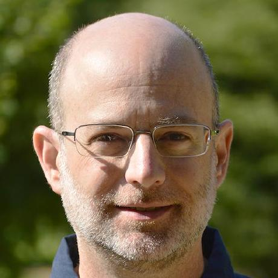
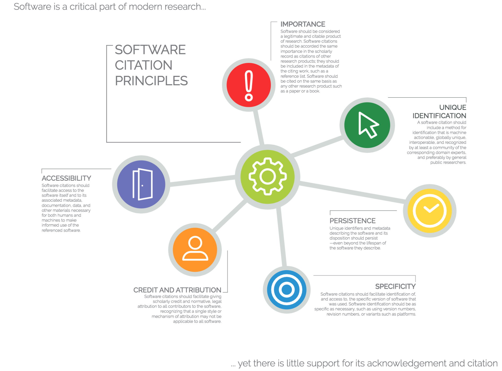
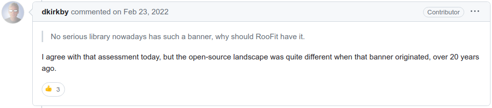
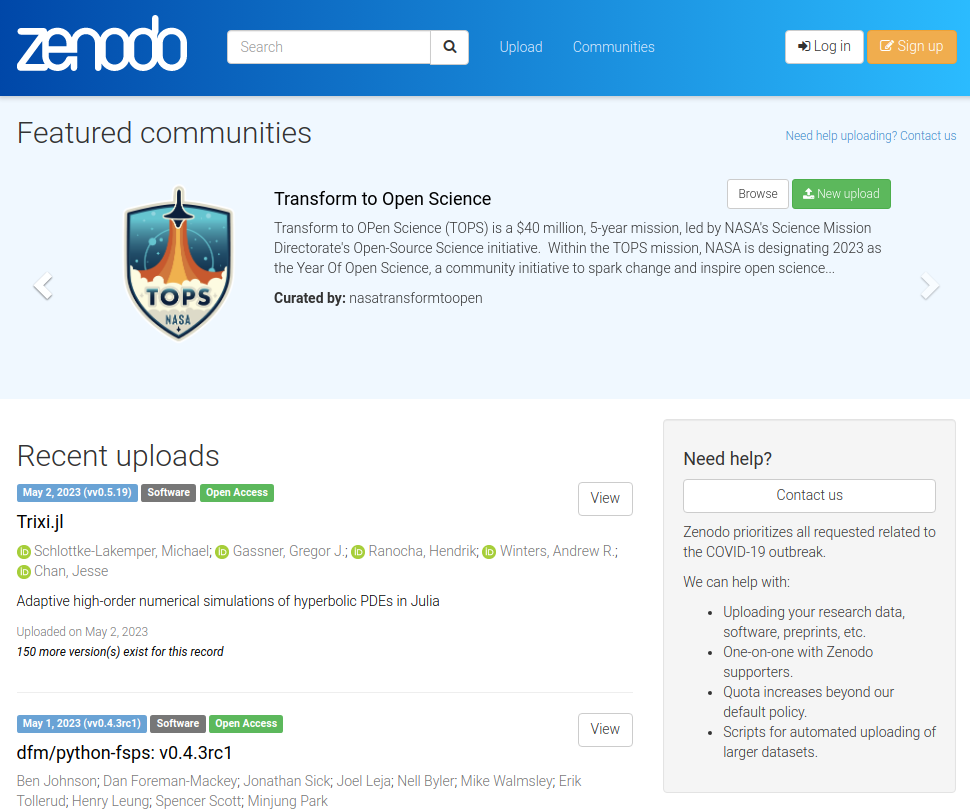
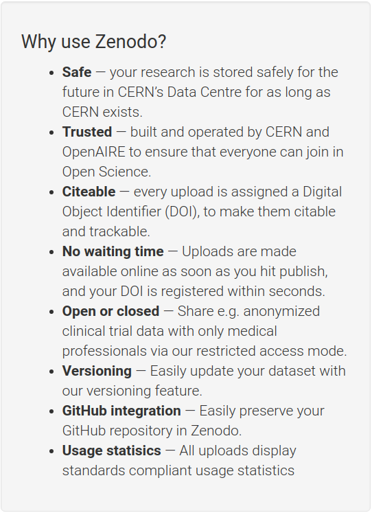
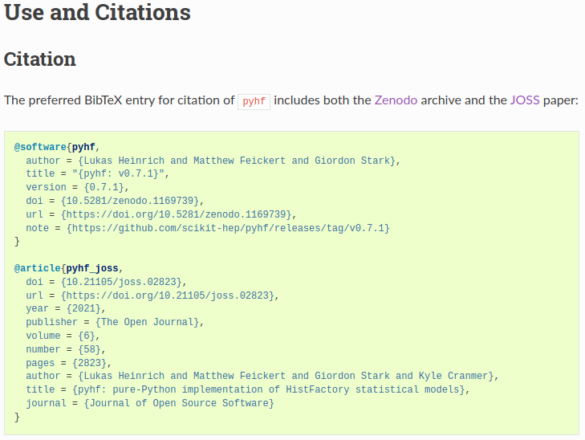
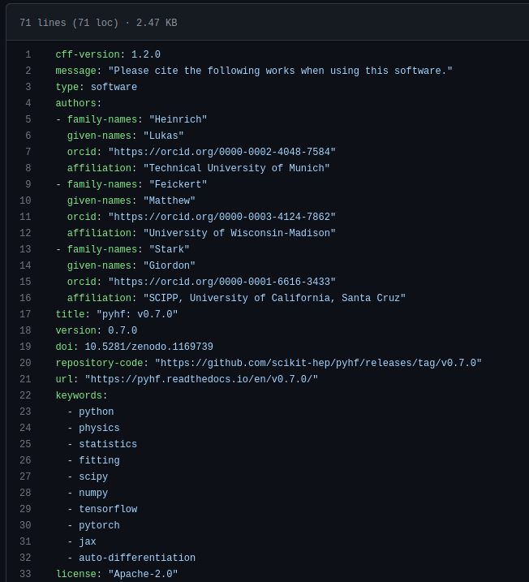
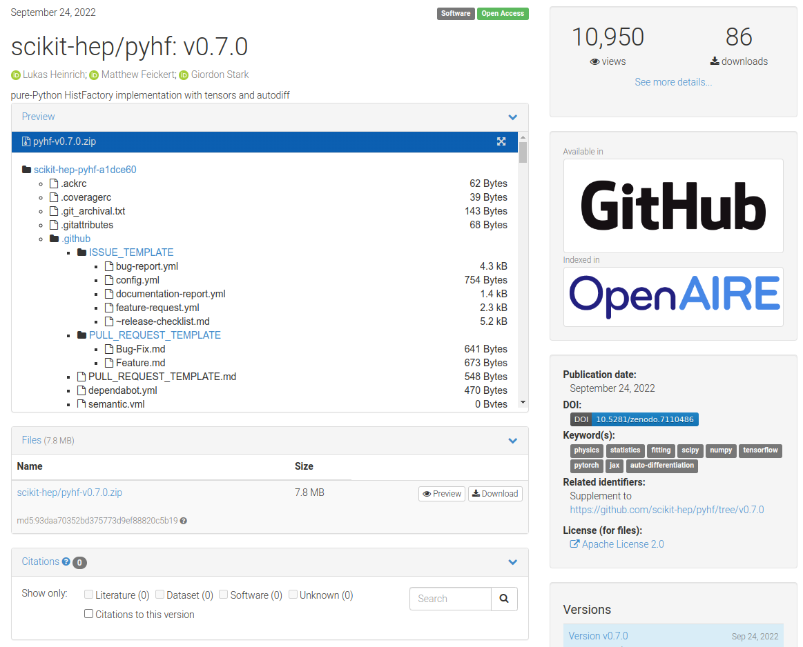

class: middle, center, title-slide
count: false

# Software Citation in HEP:<br> Current State and<br> Recommendations for the Future
.large.blue[Matthew Feickert]<br>
.large[(University of Wisconsin-Madison)]
<br>
[matthew.feickert@cern.ch](mailto:matthew.feickert@cern.ch)
<br>
Daniel Katz, Mark Neubauer, Elizabeth Sexton-Kennedy, Graeme Stewart

[International Conference on Computing in High Energy and Nuclear Physics (CHEP) 2023](https://indico.jlab.org/event/459/contributions/11688/)

May 8th, 2023

---
# Co-conveners

<br>

.grid[
.kol-1-4.center[
<!-- https://avatars.githubusercontent.com/u/2913845?v=4 -->
.circle.width-90[]

[Daniel Katz](https://danielskatz.org/)

University of Illinois at Urbana-Champaign/<br>NCSA
]
.kol-1-4.center[
.circle.width-95[]

[Mark Neubauer](https://www.marksneubauer.com/)

University of Illinois at Urbana-Champaign
]
.kol-1-4.center[
.circle.width-80[]

[Elizabeth<br>Sexton-Kennedy](https://computing.fnal.gov/liz-sexton-kennedy/)

FNAL
]
.kol-1-4.center[
.circle.width-85[]

[Graeme Stewart](https://ep-rnd.web.cern.ch/person/graeme-stewart)

CERN
]
]

---
# Software Citation and Recognition Workshop

.huge[
* [2022 HSF/IRIS-HEP Blueprint Process Workshop](https://indico.cern.ch/event/1211229/)
<br>
<br>
.italic[This meeting aims to provide a community discussion around ways in which HEP .bold[experiments handle citation of software] and .bold[recognition for software efforts] that enable physics results disseminated to the public.]
<br>
<br>
* Had representation from:
   - .bold[Experiments]: ATLAS, CMS, LHCb
   - .bold[Software project communities]: ROOT Team, Scikit-HEP, MCnet, IRIS-HEP
   - .bold[Publishers]: INSPIRE, Elsevier, Journal of Open Source Software (JOSS)
]

___

.smaller[This work was supported by the National Science Foundation under Cooperative Agreement OAC-1836650. [](https://nsf.gov/awardsearch/showAward?AWD_ID=1836650)]

---
# Principles of Software Citation

.kol-1-3.large[
As established by [FORCE11 Software Citation working group](https://force11.org/group/software-citation-working-group/) ([2016](https://force11.org/info/software-citation-principles-published-2016/), [](https://doi.org/10.7717/peerj-cs.86))

1. Importance
2. Credit and Attribution
3. Unique Identification
4. Persistence
5. Accessibility
6. Specificity
]
.kol-2-3.huge[
.center.width-85[[](https://support.datacite.org/docs/software-citation)]
.center[[Software Citation Principles](https://support.datacite.org/docs/software-citation)<br>image credit: Data Cite]
]

---
# Current State of Software Citation

.kol-1-3[
.huge[.bold[Currently have]<br>(in 2023)]
.large[
* Software citation _principles_
* _Policies_ from publishers
* Modern open source _tooling_
* Beginning of _movement_ among developers, paper authors, journal reviewers and editors
]
]
.kol-2-3.huge[
.center.width-85[[](https://support.datacite.org/docs/software-citation)]
.center[[Software Citation Principles](https://support.datacite.org/docs/software-citation)<br>image credit: Data Cite]
]

---
# Current State of Software Citation in HEP: <br>ATLAS & CMS

.huge[
.kol-1-2[
.bold.center[ATLAS]

* Use a "catch-all" citation for ATLAS software tools
* For statistical analysis and ML generally cite the papers for the methods, but not the tools and software
   - Have seen some changes when the tools explicitly ask to be cited
]
.kol-1-2[
.bold.center[CMS]
* Endorses large CMS software projects having peer reviewed papers that would be cited in physics papers
* Have expressed positive views on additional papers being written and published
]
]

---
# Current State of Software Citation in HEP: LHCb

.huge[
.kol-1-2[
* Following recommendations of [Daniel Katz's CHEP 2018 presentation](https://indico.cern.ch/event/587955/contributions/3012261/)
* Most papers aim to cite all high-level software used in the analysis
   - Cite the software, and if there's a paper for the software cite that too
* Analysts are still adopting this habit and need reminding
   - Though open to idea: "We should cite software more"
]
.kol-1-2[
.center.width-55[[](https://indico.cern.ch/event/1211229/contributions/5150192/)]
.center[LHCb citation template]
]
]

---
# Current State of Software Citation in HEP: Software Projects

.huge[
* Community views vary widely
   - .bold[ROOT team]: Explicitly not interested in software citation .italic[[for ROOT](https://indico.cern.ch/event/1211229/contributions/5150202/)] (view is too little impact)
      - "ROOT's opinion likely cannot be extrapolated"
   - .bold[Scikit-HEP]: Adopting software citation recommendations from broader open source world community norms &mdash; interested in more citations
   - .bold[MCnet]: Find Monte Carlo generators are broadly well-cited (point to LHC experiments regular citations) &mdash; current system working well
* Agreement on importance of technical solutions
   - Programmatic discovery of citations important
]

---
# Recommendations from Journals and Publishers
.huge[
* .bold[INSPIRE]
   - Currently handles software .bold[papers], but has plans to add support for .bold[Data and Software]
   - Citations would be tracked and counted .bold[by DOI]
* .bold[Elsevier]
   - .bold[Community needs to reach consensus] on how to cite software, and share outcome with publishers (won't take lead)
   - Publishers can .bold[better instruct editors and referees] what publishers expect from them
* .bold[Journal of Open Source Software]
   - In addition to incentivizing high quality software, JOSS can help .bold[[bridge the gap](https://joss.theoj.org/about)]
   - "recognize that for most researchers, papers and not software are the currency of academic research"
]

---
# Recommendations: Historical retrospective

.grid[
.kol-3-5.large[
* Software in the field might advertise citation/copyright information with runtime banners
* Conventions were not firmly established in the broader scientific computing community
<br>
.center.width-100[[](https://github.com/root-project/root/issues/9954#issuecomment-1049023607)]
* Interrupting user logs is now .bold[avoided] given modern tooling. .bold[Consider using APIs].
.kol-1-2.smaller[
```console
# CLI API
$ mytool --citation
$ mytool --cite
```
]
.kol-1-2.smaller[
```python
# Python API
import mytool
mytool.utils.citation()
```
]
]
.kol-2-5.code-tiny-tiny[
```
#--------------------------------------------------------------------------
#                         FastJet release 3.4.0
#                 M. Cacciari, G.P. Salam and G. Soyez
#     A software package for jet finding and analysis at colliders
#                           http://fastjet.fr
#
# Please cite EPJC72(2012)1896 [arXiv:1111.6097] if you use this package
# for scientific work and optionally PLB641(2006)57 [hep-ph/0512210].
#
# FastJet is provided without warranty under the GNU GPL v2 or higher.
# It uses T. Chan's closest pair algorithm, S. Fortune's Voronoi code,
# CGAL and 3rd party plugin jet algorithms. See COPYING file for details.
#--------------------------------------------------------------------------
```

___

```
RooFit v3.60 -- Developed by Wouter Verkerke and David Kirkby
                Copyright (C) 2000-2013 NIKHEF, University of California & Stanford University
                All rights reserved, please read http://roofit.sourceforge.net/license.txt
```

___

```
 *------------------------------------------------------------------------------------*
 |                                                                                    |
 |  *------------------------------------------------------------------------------*  |
 |  |                                                                              |  |
 |  |                                                                              |  |
 |  |   PPP   Y   Y  TTTTT  H   H  III    A      Welcome to the Lund Monte Carlo!  |  |
 |  |   P  P   Y Y     T    H   H   I    A A     This is PYTHIA version 8.230      |  |
 |  |   PPP     Y      T    HHHHH   I   AAAAA    Last date of change:  6 Oct 2017  |  |
 |  |   P       Y      T    H   H   I   A   A                                      |  |
 |  |   P       Y      T    H   H  III  A   A    Now is 06 May 2023 at 01:12:28    |  |
 |  |                                                                              |  |
 ...
 |  |   The main program reference is 'An Introduction to PYTHIA 8.2',             |  |
 |  |   T. Sjostrand et al, Comput. Phys. Commun. 191 (2015) 159                   |  |
 |  |   [arXiv:1410.3012 [hep-ph]]                                                 |  |
 |  |                                                                              |  |
 |  |   The main physics reference is the 'PYTHIA 6.4 Physics and Manual',         |  |
 |  |   T. Sjostrand, S. Mrenna and P. Skands, JHEP05 (2006) 026 [hep-ph/0603175]  |  |
 |  |                                                                              |  |
 |  |   An archive of program versions and documentation is found on the web:      |  |
 |  |   http://www.thep.lu.se/Pythia                                               |  |
 |  |                                                                              |  |
 |  |   This program is released under the GNU General Public Licence version 2.   |  |
 |  |   Please respect the MCnet Guidelines for Event Generator Authors and Users. |  |
 |  |                                                                              |  |
 ...
```
]
]

---
# Recommendations: CITATION.cff

.kol-3-5.large[
- Adopt the [Citation File Format](https://citation-file-format.github.io/) as a common standard and add a `CITATION.cff` to project repository
   - Human- and machine-readable file format in YAML
   - Has well defined, versioned schema
   - Convertible to other citation formats (BibTeX, CodeMeta, EndNote, RIS, schema.org, Zenodo, APA)
- Supported by [GitHub](https://docs.github.com/en/repositories/managing-your-repositorys-settings-and-features/customizing-your-repository/about-citation-files), [Zenodo](https://twitter.com/ZENODO_ORG/status/1420357001490706442), and [Zotero](https://twitter.com/zotero/status/1420515377390530560)!
- [Web tool initializer](https://citation-file-format.github.io/cff-initializer-javascript/) for easily creating first `CITATION.cff`
- [Tooling for validation](https://github.com/citation-file-format/cff-converter-python)
.tiny[
```console
$ python -m pip install cffconvert
$ cffconvert --validate
Citation metadata are valid according to schema version 1.2.0.
```
]
]
.kol-2-5[
.tiny[
```
cff-version: 1.2.0
message: "If you use this software, please cite it as below."
authors:
  - family-names: Druskat
    given-names: Stephan
    orcid: https://orcid.org/0000-0003-4925-7248
title: "My Research Software"
version: 2.0.4
doi: 10.5281/zenodo.1234
date-released: 2021-08-11
```
]

.center[Example of minimal `CITATION.cff`]

.center.width-100[[](https://docs.github.com/en/repositories/managing-your-repositorys-settings-and-features/customizing-your-repository/about-citation-files)]
]

---
# Recommendations: Zenodo
.center.huge[Versioned archive of .bold[everything]: code, documents, data products, data sets]
.center[(See [Lars Holm Nielsen's CHEP 2023 talk](https://indico.jlab.org/event/459/contributions/11673/))]

.kol-1-2[
.center.width-95[[](https://zenodo.org/)]
.center[DOI for project and each version]
]
.kol-1-2[
.center.width-60[[](https://zenodo.org/)]
]

---
# Recommendations: Make clear how to cite in docs

.kol-1-2.large[
- The easiest, but least robust way: If you have a particular citation that you want people to use, put it .bold[everywhere]
   - Version control repository README
   - Online software documentation (landing page, how to cite page)
   - Package distribution websites (e.g. PyPI)
- Have .bold[single source of truth] for citations: version control repository that all other sources derive from.
- Make your .bold[citation preferences clear] to the world and SEO. Do not rely on people emailing to ask (they shouldn't have to).
]
.kol-1-2[
.center.width-100[[](https://pyhf.readthedocs.io/en/stable/citations.html)]
.center[[pyhf's "Use and Citations" page in documentation](https://pyhf.readthedocs.io/en/stable/citations.html)]
]

---
# Revisiting Software Citation Principles in HEP

.large[
* .bold.large[Importance:] As a field HEP understands software is important, but improvements could be made on views towards research products
* .bold.large[Credit and Attribution:] Improving in HEP, but can leverage software friendly journals (i.e., JOSS) to help this
* .bold.large[Unique Identification:] Zenodo DOIs are common to HEP. CITATION.cff files can help as well.
* .bold.large[Persistence:] Long term archival through Zenodo is common practice
* .bold.large[Accessibility:] HEP is becoming more [FAIR](https://fair4hep.github.io/) focused. CITATION.cff provides common framework for metadata. Further support of INSPIRE by field could provide strong database access.
* .bold.large[Specificity:] Include version numbers in CITATION.cff
]

---
# Summary

.huge[
* Software citation is an .bold[ongoing process] that is not straightforward (for any scientific field)
* Differing community .bold[processes and standards] exist in HEP (we've never been homogeneous)
* Agreement that more citation is probably useful and .bold[programatic discovery] of citations is important
* With modern tools and standards have the opportunity to .bold[expand and standardize]
* Final summary paper from workshop forthcoming
]

---
class: end-slide, center

Backup

---
# CITATION.cff: Which DOIs?

Personal choice, but given specific release DOIs are generated .italic[after] the release is made to have the versioned and distributed `CITATION.cff` be correct at release would recommend the Zenodo project level ("cite all versions") DOI.

See valid `CITATION.cff` in talk repository ([`examples/CITATION.cff`](https://github.com/matthewfeickert-talks/talk-chep-2023/blob/main/examples/CITATION.cff)):

.smaller[
```yaml
cff-version: 1.2.0
message: "Please cite the following works when using this software."
type: software
authors:
- family-names: "Feickert"
  given-names: "Matthew"
  orcid: "https://orcid.org/0000-0003-4124-7862"
  affiliation: "University of Wisconsin-Madison"
title: "mylibrary: v1.2.3"
version: 1.2.3
# This is the _project_ DOI ("cite all versions" DOI on Zenodo page)
doi: 10.5281/zenodo.1234567
repository-code: "https://github.com/myorg/mylibrary/releases/tag/v1.2.3"
url: "https://mylibrary.readthedocs.io/en/v1.2.3/"
keywords:
  - example
  - software
license: "Apache-2.0"
```
]

---
# CITATION.cff: How to keep up to date?

.large[
- As plain text, very easy to update version information when cutting a release
- Can use tool control of version update to make it easier
   - Example: [`tbump`](https://github.com/your-tools/tbump)
   - `$ tbump <version target>`
- Also possible to have [automated version bump workflows](https://github.com/scikit-hep/pyhf/blob/d9355e23ffd4aceb24041c51c697a55fa40a3d94/.github/workflows/bump-version.yml) using continuous integration
- (Jumping ahead a slide) What about the Zenodo DOI?
   - For simplicity, use the project level DOI and not the version level DOI
]

.smaller[
```yaml
cff-version: 1.2.0
message: "Please cite the following works when using this software."
type: software
...
title: "mylibrary: v1.2.3"
version: 1.2.3
doi: 10.5281/zenodo.1123456
repository-code: "https://github.com/myorg/mylibrary/releases/tag/v1.2.3"
url: "https://mylibrary.readthedocs.io/en/v1.2.3/"
```
]

---
# Zenodo: DOI minting made easy

- Everything on Zenodo has a DOI
   - Provides both a .bold[project] DOI (resolves to latest) and .bold[version specific] DOI
- Enable it to [automatically preserve work from GitHub](https://guides.github.com/activities/citable-code/) (can also directly upload, but lose out on automation)
   - Benefit from having a DOI for .bold[every version] regardless of software paper landscape state
- Once you have a DOI, put it .bold[everywhere] (again)
   - Recommend sharing the project DOI and letting users select a specific version if they want it

.center[
.width-80[[](https://zenodo.org/account/settings/github/)]
]

---
# Zenodo + CITATION.cff

.center.large[CITATION.cff used by Zenodo importer to fully define Zenodo archive metadata]

.kol-1-2[
.center.width-85[[](https://github.com/scikit-hep/pyhf/blob/d9355e23ffd4aceb24041c51c697a55fa40a3d94/CITATION.cff)]
]
.kol-1-2[
.center.width-110[[](https://zenodo.org/record/7110486)]
]

---

class: end-slide, center
count: false

The end.
